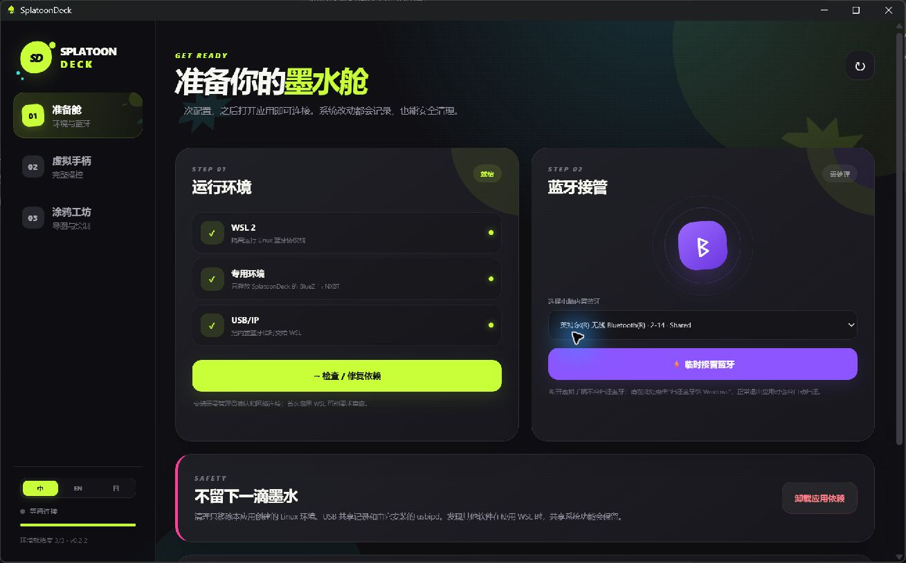
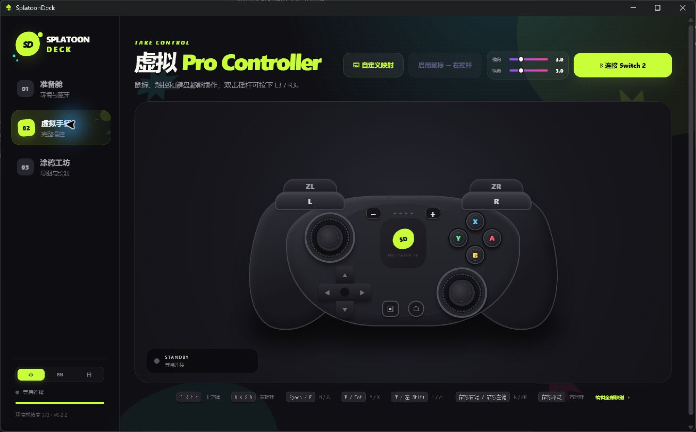
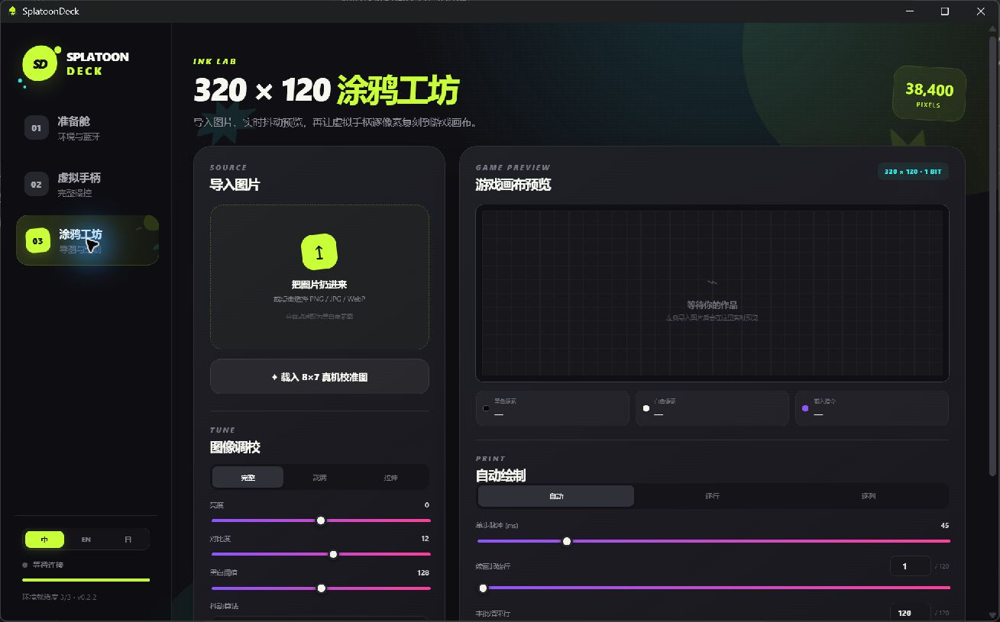

<p align="center">
  
</p>

<h1 align="center">SplatoonDeck</h1>

<p align="center">
  简体中文 · <a href="./README_EN.md">English</a> · <a href="./README_JA.md">日本語</a>
</p>

<p align="center">
  <strong>用键盘鼠标控制 Switch 2，把喜欢的图片自动画进 Splatoon 3。</strong>
</p>

<p align="center">
  <a href="https://github.com/Polaris-SJTU/SplatoonDeck/releases/latest"></a>
  <a href="https://github.com/Polaris-SJTU/SplatoonDeck/releases"></a>
  <a href="./LICENSE"></a>
  
  
</p>

SplatoonDeck 是一款面向 Splatoon 3 玩家的 Windows 工具。它可以把电脑变成一只虚拟 Pro Controller，让你用键盘和鼠标操作 Switch 2；也可以把照片、头像、文字或线稿转换成游戏涂鸦画布，并自动完成绘制。

无需购买 ESP32、树莓派或专用手柄转接板。SplatoonDeck 会在独立环境中管理蓝牙连接，使用完后也可以在应用里将蓝牙归还 Windows。

## 下载与使用

### 运行要求

- Windows 11 x64。
- Switch 2 与 Splatoon 3。
- 电脑内置或已有的、可被应用识别的 USB 蓝牙控制器。
- 首次准备环境时需要网络连接和管理员权限。

下载当前版本：[`SplatoonDeck-0.3.0-portable.exe`](https://github.com/Polaris-SJTU/SplatoonDeck/releases/download/v0.3.0/SplatoonDeck-0.3.0-portable.exe)

SplatoonDeck 是单文件便携应用，不需要传统安装。后续版本请前往 [GitHub Releases](https://github.com/Polaris-SJTU/SplatoonDeck/releases/latest) 获取。

`v0.3.0` 增加了手柄操作宏的录制与循环回放，并重构了环境管理。安装按阶段执行并可在重启后继续；窗口会实时显示步骤、进度和命令输出，关闭窗口会同步取消子进程。Ubuntu 环境下载支持断点续传、自动重试与 SHA-256 校验。卸载只移除 SplatoonDeck 添加的组件，同时保留用户原有或其他软件正在使用的 WSL 环境。完整内容请查看 [v0.3.0 发布说明](https://github.com/Polaris-SJTU/SplatoonDeck/releases/tag/v0.3.0)。

### 第一次连接 Switch 2

1. 运行 SplatoonDeck，进入“准备舱”。界面左下角可以随时切换简体中文、English 和日本語，选择会自动保存。
2. 点击“检查 / 修复依赖”。应用会先准备 WSL、Windows 功能和蓝牙组件；如果提示重启，请重启 Windows、重新打开 SplatoonDeck，再点击“继续安装”，程序会从下一阶段接着执行。
3. 运行兼容性诊断，确认 WSL、USB/IP、BlueZ、NXBT 和蓝牙控制器均已就绪。
4. 选择检测到的蓝牙控制器，点击“临时接管蓝牙”。
5. 在 Switch 2 打开“手柄 → 更改握法/顺序”。
6. 进入 SplatoonDeck 的“虚拟手柄”，点击“连接 Switch 2”。
7. 连接成功后，用界面按键或默认键鼠映射确认游戏能够正常响应。

连接后请继续使用 SplatoonDeck 操作游戏，避免启用另一只物理手柄导致虚拟手柄断开。点击“断开连接”只会断开虚拟手柄，蓝牙仍由 SplatoonDeck 保持，方便再次连接；需要恢复 Windows 蓝牙时，请回到“准备舱”点击“归还蓝牙给 Windows”。

### 用键盘和鼠标操作游戏

- `W` `A` `S` `D` 默认控制左摇杆，鼠标移动默认控制右摇杆。
- 点击“启用鼠标 → 右摇杆”后，鼠标会锁定在手柄区域；按 `Esc` 可以释放鼠标。
- 水平和垂直灵敏度可以分别调节。
- 点击“自定义映射”可以修改键盘按键、鼠标按键和鼠标移动的对应操作。
- 界面上的全部按键、十字键和双摇杆也可以直接点击或拖动。

### 录制并重复一组操作

1. 连接 Switch 2 后，在“虚拟手柄”底部找到“宏录制与回放”。
2. 点击“开始录制”，再使用屏幕手柄、键盘或鼠标完成一遍操作；按键、摇杆位置和每次操作之间的时间都会被记录。
3. 点击“停止录制”保存序列。录制内容只保存在当前电脑，下次启动应用仍可使用。
4. 选择回放次数，或启用“无限循环”，然后点击“回放”。应用会按录制时的原始节奏重复执行。
5. 无限循环或长时间回放可以随时点击“停止回放”；回放期间其他手柄输入会暂时锁定。

### 把图片自动画进 Splatoon 3

1. 先在游戏中进入 Splatoon 3 的横向涂鸦画布，并让画布保持在可绘制状态。
2. 在 SplatoonDeck 的“涂鸦工坊”导入 PNG、JPG、WebP 或 BMP 图片。
3. 选择完整、裁满或拉伸布局，再调整亮度、对比度、黑白阈值、反色和抖动风格。
4. 在右侧确认最终的 `320 × 120` 黑白像素预览。预览和自动绘制使用同一份像素数据。
5. 扫描方向通常保持“自动”即可；首次建议使用默认的 `45 ms` 按键间隔。
6. 点击“开始自动绘制”。应用会自动清空画布、移动到起点、切换到最小画笔并开始落笔。
7. 绘制时可以查看当前光标、已完成像素、进度和剩余时间。完成后应用会执行保存确认。

如果中途停止，图片和参数会继续保留。根据界面给出的进度修改“续画起始行 / 列”，即可从指定位置继续；续画时不会再次清空已经完成的画布。

## 界面预览

### 准备舱

一站式检查运行环境、接管蓝牙，并在需要时将蓝牙归还 Windows。



### 虚拟手柄

通过拟真的 Pro Controller 界面操作 Switch 2，也可以使用自定义键盘与鼠标映射。



### 涂鸦工坊

导入图片、调整黑白像素效果，预览 `320 × 120` 游戏画布并启动自动绘制。



## 主要功能

### 像真正的手柄一样操作

- 完整的 Pro Controller 布局与按键。
- 支持键盘、鼠标按键、鼠标移动和触控操作。
- 所有映射都可以自由修改。
- 鼠标横向、纵向灵敏度可以分别调节。
- 可以录制按键、双摇杆与操作间隔，按指定次数回放或持续循环到手动停止。
- 连接后可以直接完成游戏操作，不需要来回切换物理手柄。

### 把图片自动画进游戏

- 支持 PNG、JPG、WebP 和 BMP。
- 自动转换成 Splatoon 3 的 `320 × 120` 黑白像素画。
- 提供完整、裁满、拉伸三种图片布局。
- 可以调整亮度、对比度、黑白阈值和反色。
- 提供四种像素转换风格，适合照片、头像、文字和线稿。
- 实时预览最终画面，预览内容与绘制路径使用同一份像素数据。
- 自动清空画布、选择最小画笔并移动到正确起点。
- 更换图片后自动刷新绘制范围，支持逐行和逐列两种扫描方向。
- 方向键按单像素移动，并通过持续的完整手柄状态报告提高长时间绘制稳定性。
- 预览图实时显示光标位置，已完成像素逐点变色。
- 支持剩余时间显示、停止绘制、指定范围和中断续画。

### 对新手友好的环境管理

- 自动检测电脑中的 USB 蓝牙。
- 在应用内安装、检查、修复和清理所需组件。
- 安装与卸载窗口实时显示步骤和命令输出，失败时等待用户确认并保留日志位置。
- 安装与卸载只能同时运行一个；关闭进度窗口时，其启动的 DISM、winget 等子进程会一并停止。
- Ubuntu 环境下载支持断点续传、四次自动重试和官方 SHA-256 校验，未完成文件不会被误当作可用环境。
- 准确区分安装重启和卸载重启，不会在清理后错误提示“继续安装”。
- 如果电脑原先没有 WSL，会在卸载时清理由 SplatoonDeck 新增的 WSL 运行时和系统功能；已有环境及其他发行版会保留。
- 跨重启保存安装进度和组件归属，重新打开应用后可以继续准备或安全清理。
- 蓝牙可以临时交给 SplatoonDeck 使用，也可以随时归还 Windows。
- 内置兼容性诊断，遇到问题时可以快速找到未准备好的项目。
- 应用界面支持简体中文、English 和日本語，并会记住上次选择。
- 使用独立运行环境，不会改动已有的 Linux 发行版；清理时也会保留其他软件正在使用的共享环境。

## 图片效果

SplatoonDeck 会把导入图片转换成 38,400 个黑白像素。你可以在绘制前实时调整效果：

- **Floyd–Steinberg**：层次细腻，适合照片和渐变。
- **Atkinson**：画面清爽，适合头像和插画。
- **Bayer 4×4**：带有规则网点风格。
- **纯阈值**：边缘干净，适合文字和线稿。

预览画布固定为 `320 × 120`。自动模式会根据图片选择逐行或逐列路径，也可以由玩家手动指定扫描方向。

## 默认键鼠映射

| 输入 | 对应操作 |
| --- | --- |
| `W` `A` `S` `D` | 左摇杆 |
| 鼠标移动 | 右摇杆 |
| `Space` | B |
| `Tab` | X |
| `R` | Y |
| `F` | A |
| `T` | L |
| 鼠标右键 | R |
| 左 `Shift` | ZL |
| 鼠标左键 | ZR |
| `Q` | L3 |
| `1` `2` `3` `4` | 十字键上、下、左、右 |
| `-` `+` | 减号、加号 |
| `H` | Home |
| `C` | 截图 |

所有映射都可以在“虚拟手柄 → 自定义映射”里修改。

## 常见问题

### 断开手柄后，为什么蓝牙没有立即回到 Windows？

这是为了让下次连接 Switch 2 时不必重新接管蓝牙。需要恢复耳机、鼠标等 Windows 蓝牙设备时，请在“准备舱”点击“归还蓝牙给 Windows”。

### 自动绘制时还能操作虚拟手柄吗？

不能。绘制期间会锁定图像参数和手柄输入，避免额外按键改变光标位置；停止或完成后会自动恢复。

### 绘制中断后怎样继续？

回到“涂鸦工坊”，根据停止位置调整“续画起始行 / 列”，保持原图和其他参数不变后重新开始。续画不会执行清空画布。

### 怎样获得更稳定的绘制效果？

首次建议使用默认的 `45 ms` 间隔并先绘制内置 `8 × 7` 校准图。自动绘制期间不要在 Switch 2 上切换手柄，也不要操作其他控制器。

### 如何删除 SplatoonDeck 准备的环境？

在“准备舱”归还蓝牙后点击“卸载应用依赖”。SplatoonDeck 会根据本机保存的安装记录，归还并解除由应用接管的蓝牙、删除专用 Linux 环境，并卸载由应用安装的 usbipd。如果使用前电脑没有 WSL 且当前没有其他 WSL 发行版，还会移除由应用新增的 WSL 运行时并关闭由它启用的 Windows 功能。如果界面提示重启，重启一次即可完成清理。

## 工作原理与兼容性

SplatoonDeck 的 Windows 界面负责图片处理、键鼠输入和绘制进度；内置的原生安装辅助程序负责提权与环境管理，不依赖 PowerShell；专用 WSL 2 环境负责 BlueZ 与虚拟 Pro Controller。应用通过 USB/IP 临时接管蓝牙控制器，再由 NXBT 和 Python 桥接程序把按键、摇杆与绘制路径发送给 Switch 2。

自动绘制会先把图片转换成严格的 `320 × 120` 一位黑白矩阵，再根据同一份矩阵生成预览、绘制路径和进度数据。绘制过程中使用完整的手柄状态报告，并在每个有效行或列重新贴边定位，减少累计误差。

当前兼容基线：

- Windows 11 x64。
- Switch 2 与 Splatoon 3。
- 可被 USB/IP 接管的 USB 蓝牙控制器。
- WSL 2、BlueZ 与 NXBT 由应用的专用环境统一管理。

不同电脑使用的蓝牙芯片和驱动可能不同，建议第一次运行时先使用应用内的兼容性诊断和 8 × 7 校准图。

## 开发与构建

需要 Git、当前维护的 Node.js LTS 和 npm。

```powershell
git clone https://github.com/Polaris-SJTU/SplatoonDeck.git
cd SplatoonDeck
npm.cmd install
npm.cmd run dev
```

```powershell
npm.cmd test       # 运行测试
npm.cmd run build  # 构建前端
npm.cmd run dist   # 打包便携 EXE
```

主要目录：

```text
SplatoonDeck/
├─ src/        应用界面、键鼠映射与图片处理
├─ electron/   Windows、蓝牙和应用生命周期
├─ backend/    虚拟手柄桥接程序
├─ native/     原生环境管理辅助程序
├─ scripts/    WSL 内部环境准备脚本
├─ assets/     品牌源文件
└─ build/      应用图标
```

## 参与项目

欢迎通过 [Issues](https://github.com/Polaris-SJTU/SplatoonDeck/issues) 提交建议、兼容性反馈和问题，也欢迎提交 Pull Request。

提交代码前请运行：

```powershell
npm.cmd test
npm.cmd run build
```

## 致谢

- [Microsoft WSL](https://learn.microsoft.com/windows/wsl/)
- [usbipd-win](https://github.com/dorssel/usbipd-win)
- [NXBT](https://github.com/Brikwerk/nxbt)
- [img2splat](https://github.com/JonathanNye/img2splat)

## 许可证

代码使用 [MIT License](./LICENSE)。

SplatoonDeck 使用原创界面与品牌元素，不包含任天堂或 Splatoon 官方素材。本项目与 Nintendo、Nintendo Switch、Switch 2、Splatoon 或其权利人无隶属、赞助或背书关系；相关名称与商标归各自权利人所有。
