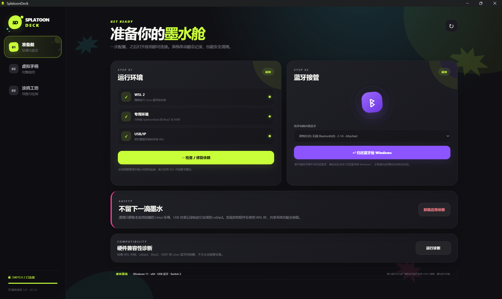
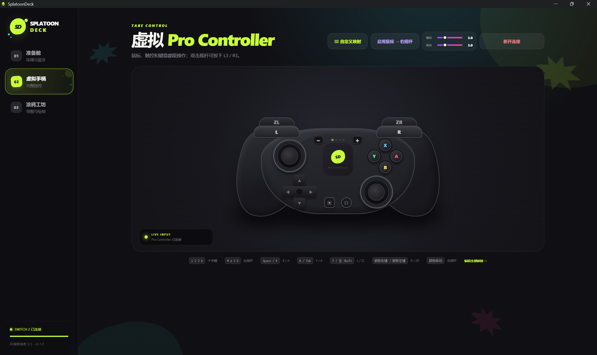
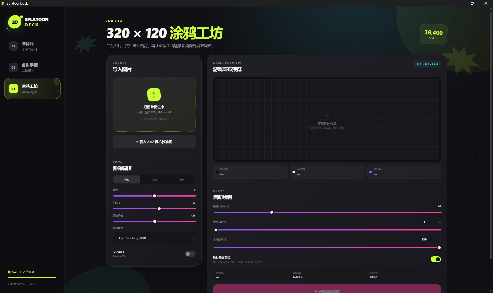

<p align="center">
  
</p>

<h1 align="center">SplatoonDeck</h1>

<p align="center">
  <strong>用键盘鼠标控制 Switch 2，把喜欢的图片自动画进 Splatoon 3。</strong>
</p>

<p align="center">
  <a href="https://github.com/Polaris-SJTU/SplatoonDeck/releases/latest"></a>
  <a href="https://github.com/Polaris-SJTU/SplatoonDeck/releases"></a>
  <a href="./LICENSE"></a>
  
  
</p>

SplatoonDeck 是一款为 Windows 11、Switch 2 和 Splatoon 3 打造的便携工具。无需购买 ESP32、树莓派或其他外设，只需使用电脑自带或现有的 USB 蓝牙，就能获得虚拟 Pro Controller、键鼠操控和图片自动绘制功能。

## 界面预览

### 准备舱

一站式检查运行环境、接管蓝牙，并在需要时将蓝牙归还 Windows。



### 虚拟手柄

通过拟真的 Pro Controller 界面操作 Switch 2，也可以使用自定义键盘与鼠标映射。



### 涂鸦工坊

导入图片、调整黑白像素效果，预览 `320 × 120` 游戏画布并启动自动绘制。



## 下载

前往 [GitHub Releases](https://github.com/Polaris-SJTU/SplatoonDeck/releases/latest) 下载最新版：

- [`SplatoonDeck-0.1.0-portable.exe`](https://github.com/Polaris-SJTU/SplatoonDeck/releases/download/v0.1.0/SplatoonDeck-0.1.0-portable.exe)
- [`SHA-256 校验文件`](https://github.com/Polaris-SJTU/SplatoonDeck/releases/download/v0.1.0/SplatoonDeck-0.1.0-portable.exe.sha256)

SplatoonDeck 是单文件便携应用，不需要传统安装。首次运行时，可以直接在应用里准备和管理所需环境。

## 主要功能

### 像真正的手柄一样操作

- 完整的 Pro Controller 布局与按键。
- 支持键盘、鼠标按键、鼠标移动和触控操作。
- 所有映射都可以自由修改。
- 鼠标横向、纵向灵敏度可以分别调节。
- 连接后可以直接完成游戏操作，不需要来回切换物理手柄。

### 把图片自动画进游戏

- 支持 PNG、JPG、WebP 和 BMP。
- 自动转换成 Splatoon 3 的 `320 × 120` 黑白像素画。
- 提供完整、裁满、拉伸三种图片布局。
- 可以调整亮度、对比度、黑白阈值和反色。
- 提供四种像素转换风格，适合照片、头像、文字和线稿。
- 实时预览最终画面，预览内容与绘制路径使用同一份像素数据。
- 自动清空画布、选择最小画笔并移动到正确起点。
- 支持剩余时间显示、停止绘制、指定行数和中断续画。

### 对新手友好的环境管理

- 自动检测电脑中的 USB 蓝牙。
- 在应用内安装、检查、修复和清理所需组件。
- 蓝牙可以临时交给 SplatoonDeck 使用，也可以随时归还 Windows。
- 内置兼容性诊断，遇到问题时可以快速找到未准备好的项目。
- 独立保存运行环境，不会修改已有的 Linux 发行版。

## 快速开始

1. 下载并运行 `SplatoonDeck-0.1.0-portable.exe`。
2. 打开“准备舱”，点击“一键安装依赖”。如果系统提示重启，重启后再打开应用继续。
3. 运行兼容性诊断，选择检测到的 USB 蓝牙并点击“临时接管蓝牙”。
4. 在 Switch 2 打开“手柄 → 更改握法/顺序”。
5. 进入 SplatoonDeck 的“虚拟手柄”，点击“连接 Switch 2”。
6. 先试一下按键和摇杆，确认可以正常控制游戏。
7. 进入 Splatoon 3 横向涂鸦画布，在“涂鸦工坊”载入内置校准图。
8. 校准图绘制正确后，导入自己的图片并开始自动绘制。

绘制完成后由玩家在游戏里检查并发布。断开虚拟手柄时蓝牙会继续由 SplatoonDeck 保持，方便再次连接；需要恢复 Windows 蓝牙时，请回到“准备舱”点击归还。

## 图片效果

SplatoonDeck 会把导入图片转换成 38,400 个黑白像素。你可以在绘制前实时调整效果：

- **Floyd–Steinberg**：层次细腻，适合照片和渐变。
- **Atkinson**：画面清爽，适合头像和插画。
- **Bayer 4×4**：带有规则网点风格。
- **纯阈值**：边缘干净，适合文字和线稿。

预览画布固定为 `320 × 120`。自动绘制会逐行访问对应位置，让游戏中的落笔顺序和预览保持一致。

## 默认键鼠映射

| 输入 | 对应操作 |
| --- | --- |
| `W` `A` `S` `D` | 左摇杆 |
| 鼠标移动 | 右摇杆 |
| `Space` | B |
| `Tab` | X |
| `R` | Y |
| `F` | A |
| `T` | L |
| 鼠标右键 | R |
| 左 `Shift` | ZL |
| 鼠标左键 | ZR |
| `Q` | L3 |
| `1` `2` `3` `4` | 十字键上、下、左、右 |
| `-` `+` | 减号、加号 |
| `H` | Home |
| `C` | 截图 |

所有映射都可以在“虚拟手柄 → 自定义映射”里修改。

## 兼容环境

- Windows 11 x64。
- Switch 2 与 Splatoon 3。
- 可被应用识别的 USB 蓝牙控制器。
- 首次准备环境时需要网络连接和管理员权限。

不同电脑使用的蓝牙芯片和驱动可能不同，建议第一次运行时先使用应用内的兼容性诊断和 8 × 7 校准图。

## 开发与构建

需要 Git、当前维护的 Node.js LTS 和 npm。

```powershell
git clone https://github.com/Polaris-SJTU/SplatoonDeck.git
cd SplatoonDeck
npm.cmd install
npm.cmd run dev
```

```powershell
npm.cmd test       # 运行测试
npm.cmd run build  # 构建前端
npm.cmd run dist   # 打包便携 EXE
```

主要目录：

```text
SplatoonDeck/
├─ src/        应用界面、键鼠映射与图片处理
├─ electron/   Windows、蓝牙和应用生命周期
├─ backend/    虚拟手柄桥接程序
├─ scripts/    环境安装与清理脚本
├─ assets/     品牌源文件
└─ build/      应用图标
```

## 参与项目

欢迎通过 [Issues](https://github.com/Polaris-SJTU/SplatoonDeck/issues) 提交建议、兼容性反馈和问题，也欢迎提交 Pull Request。

提交代码前请运行：

```powershell
npm.cmd test
npm.cmd run build
```

## 致谢

- [Microsoft WSL](https://learn.microsoft.com/windows/wsl/)
- [usbipd-win](https://github.com/dorssel/usbipd-win)
- [NXBT](https://github.com/Brikwerk/nxbt)
- [img2splat](https://github.com/JonathanNye/img2splat)

## 许可证

代码使用 [MIT License](./LICENSE)。

SplatoonDeck 使用原创界面与品牌元素，不包含任天堂或 Splatoon 官方素材。本项目与 Nintendo、Nintendo Switch、Switch 2、Splatoon 或其权利人无隶属、赞助或背书关系；相关名称与商标归各自权利人所有。
