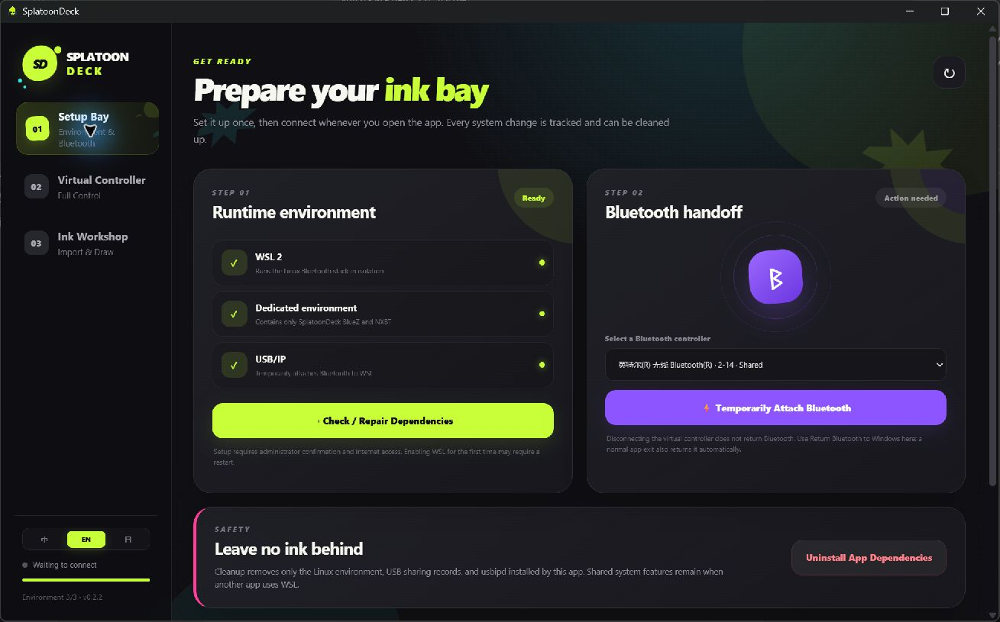
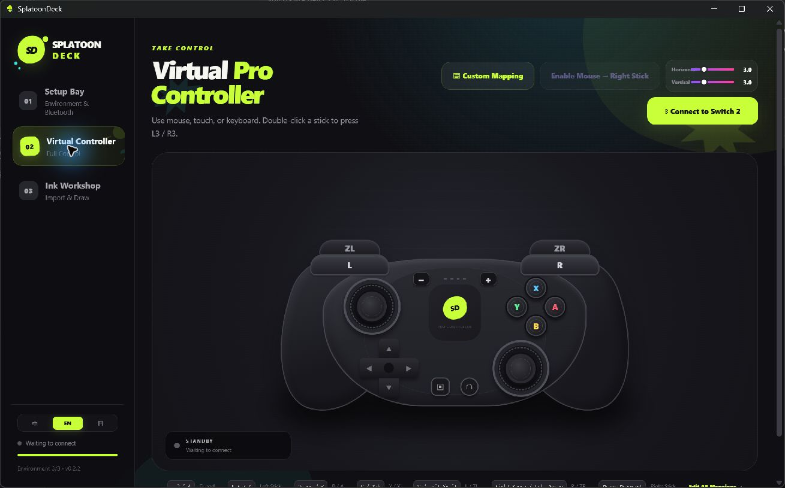
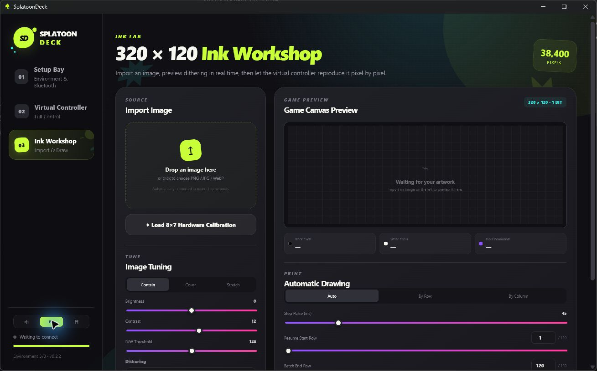

<p align="center">
  
</p>

<h1 align="center">SplatoonDeck</h1>

<p align="center">
  <a href="./README.md">简体中文</a> · English · <a href="./README_JA.md">日本語</a>
</p>

<p align="center">
  <strong>Control your Switch 2 with keyboard and mouse, and draw your favorite images in Splatoon 3.</strong>
</p>

<p align="center">
  <a href="https://github.com/Polaris-SJTU/SplatoonDeck/releases/latest"></a>
  <a href="https://github.com/Polaris-SJTU/SplatoonDeck/releases"></a>
  <a href="./LICENSE"></a>
  
  
</p>

SplatoonDeck is a Windows companion built for Splatoon 3 players. It turns your PC into a virtual Pro Controller so you can operate a Switch 2 with keyboard and mouse. It can also convert a photo, avatar, piece of text, or line drawing into the game's post canvas and draw it automatically.

No ESP32, Raspberry Pi, or dedicated controller adapter is required. SplatoonDeck manages the Bluetooth connection inside an isolated environment and can return the adapter to Windows when you are done.

## Download and use

### Requirements

- Windows 11 x64.
- Switch 2 and Splatoon 3.
- A built-in or existing USB Bluetooth controller that SplatoonDeck can detect.
- An internet connection and administrator permission for the first-time setup.

Download the current version: [`SplatoonDeck-0.2.3-portable.exe`](https://github.com/Polaris-SJTU/SplatoonDeck/releases/download/v0.2.3/SplatoonDeck-0.2.3-portable.exe)

SplatoonDeck is a single-file portable app and does not need a traditional installation. For later versions, visit [GitHub Releases](https://github.com/Polaris-SJTU/SplatoonDeck/releases/latest).

`v0.2.3` focuses on setup and cleanup on a fresh PC. Installation results are recorded accurately, setup continues correctly after restarting Windows, diagnostics are clearer, and cleanup uses the saved installation record to remove components added by SplatoonDeck. See the complete [v0.2.3 release notes](https://github.com/Polaris-SJTU/SplatoonDeck/releases/tag/v0.2.3).

### Connect to Switch 2 for the first time

1. Run SplatoonDeck and open **Setup Bay**. Use the language selector at the bottom-left to switch between Simplified Chinese, English, and Japanese; your choice is saved automatically.
2. Select **Check / Repair Dependencies** and follow the prompts to prepare WSL 2, the dedicated environment, and Bluetooth components. If Windows asks for a restart, restart it, reopen SplatoonDeck, and select **Check / Repair Dependencies** again to finish the remaining steps.
3. Run the compatibility diagnostics and confirm that WSL, USB/IP, BlueZ, NXBT, and the Bluetooth controller are ready.
4. Select the detected Bluetooth controller and choose **Temporarily Attach Bluetooth**.
5. On Switch 2, open **Controllers → Change Grip/Order**.
6. Open **Virtual Controller** in SplatoonDeck and select **Connect to Switch 2**.
7. After it connects, test the on-screen controls or the default keyboard and mouse mappings.

Keep using SplatoonDeck to control the game after connecting. Enabling another physical controller may disconnect the virtual controller. **Disconnect** stops only the virtual controller while leaving Bluetooth attached to SplatoonDeck for quick reconnection. To restore normal Windows Bluetooth, return to Setup Bay and select **Return Bluetooth to Windows**.

### Play with keyboard and mouse

- `W` `A` `S` `D` control the left stick by default; mouse movement controls the right stick.
- Select **Enable Mouse → Right Stick** to lock the pointer inside the controller area. Press `Esc` to release it.
- Horizontal and vertical sensitivity can be adjusted independently.
- Select **Custom Mapping** to change keyboard keys, mouse buttons, and mouse-motion assignments.
- Every button, the D-pad, and both sticks can also be clicked or dragged directly on screen.

### Draw an image in Splatoon 3

1. In Splatoon 3, enter the horizontal post-drawing canvas and leave it ready for drawing.
2. Open **Ink Workshop** in SplatoonDeck and import a PNG, JPG, WebP, or BMP image.
3. Choose Contain, Cover, or Stretch, then adjust brightness, contrast, the black-and-white threshold, inversion, and dithering style.
4. Check the final `320 × 120` monochrome preview on the right. The preview and automatic drawing use the same pixel data.
5. The Auto scan mode is suitable for most images. Start with the default `45 ms` button interval.
6. Select **Start Automatic Drawing**. SplatoonDeck clears the canvas, moves to the starting point, switches to the smallest brush, and begins drawing automatically.
7. While drawing, you can monitor the cursor, completed pixels, progress, and remaining time. SplatoonDeck performs the save confirmation when it finishes.

If you stop midway, the image and its settings remain available. Update **Resume Start Row / Column** from the displayed progress and start again. A resumed drawing does not clear the completed canvas.

## Interface preview

### Setup Bay

Check the runtime environment, hand Bluetooth to SplatoonDeck, and return it to Windows when needed.



### Virtual Controller

Operate Switch 2 through a Pro Controller-inspired interface or custom keyboard and mouse mappings.



### Ink Workshop

Import an image, tune its monochrome pixel treatment, preview the `320 × 120` game canvas, and start automatic drawing.



## Main features

### Control it like a real gamepad

- Full Pro Controller layout and buttons.
- Keyboard, mouse buttons, mouse movement, and touch input.
- Fully customizable mappings.
- Independent horizontal and vertical mouse sensitivity.
- Complete game control after connecting, without switching back and forth to a physical controller.

### Draw images automatically in the game

- PNG, JPG, WebP, and BMP support.
- Automatic conversion to Splatoon 3's `320 × 120` monochrome pixel canvas.
- Contain, Cover, and Stretch image layouts.
- Brightness, contrast, threshold, and inversion controls.
- Four pixel-conversion styles for photos, avatars, text, and line art.
- Live final preview backed by the same pixel data as the drawing path.
- Automatic canvas clearing, smallest-brush selection, and starting-point positioning.
- Automatic drawing-range refresh after replacing an image, with row and column scan modes.
- Single-pixel D-pad movement with continuous full controller-state reports for stable long drawings.
- Live cursor position and completed-pixel highlighting in the preview.
- Remaining-time display, manual stop, selectable ranges, and resume support.

### Beginner-friendly environment management

- Automatic detection of USB Bluetooth controllers.
- In-app installation, checking, repair, and cleanup of required components.
- Setup progress and component ownership are preserved across restarts, so the app can safely continue setup or clean up later.
- Temporarily hand Bluetooth to SplatoonDeck and return it to Windows at any time.
- Built-in compatibility diagnostics.
- The interface supports Simplified Chinese, English, and Japanese, and remembers your last choice.
- A dedicated runtime that does not modify existing Linux distributions and preserves shared environments used by other software during cleanup.

## Image processing

SplatoonDeck converts an imported image into 38,400 black-and-white pixels. You can tune the result in real time before drawing:

- **Floyd–Steinberg**: detailed tonal rendering for photos and gradients.
- **Atkinson**: a cleaner look for avatars and illustrations.
- **Bayer 4×4**: a regular halftone pattern.
- **Threshold**: crisp edges for text and line art.

The preview canvas is always `320 × 120`. Auto mode chooses a row or column path based on the image, and you can override the direction manually.

## Default keyboard and mouse mappings

| Input | Controller action |
| --- | --- |
| `W` `A` `S` `D` | Left stick |
| Mouse movement | Right stick |
| `Space` | B |
| `Tab` | X |
| `R` | Y |
| `F` | A |
| `T` | L |
| Right mouse button | R |
| Left `Shift` | ZL |
| Left mouse button | ZR |
| `Q` | L3 |
| `1` `2` `3` `4` | D-pad Up, Down, Left, Right |
| `-` `+` | Minus, Plus |
| `H` | Home |
| `C` | Capture |

All mappings can be changed under **Virtual Controller → Custom Mapping**.

## FAQ

### Why does Bluetooth not return to Windows when I disconnect the controller?

This lets SplatoonDeck reconnect to Switch 2 without taking over the adapter again. To restore Windows Bluetooth devices such as headphones and mice, select **Return Bluetooth to Windows** in Setup Bay.

### Can I use the virtual controller during automatic drawing?

No. Image settings and controller input are locked during drawing so an extra input cannot move the cursor. They are restored after the drawing stops or completes.

### How do I continue an interrupted drawing?

Return to Ink Workshop, set **Resume Start Row / Column** from the stopping point, keep the original image and other settings unchanged, and start again. Resume mode does not clear the canvas.

### How can I get the most stable drawing result?

Start with the default `45 ms` interval and draw the built-in `8 × 7` calibration image first. Do not change controllers or operate another controller while automatic drawing is active.

### How do I remove the environment created by SplatoonDeck?

Return Bluetooth in Setup Bay, then select **Uninstall App Dependencies**. SplatoonDeck uses its saved installation record to return and unshare Bluetooth, remove the dedicated Linux environment, and uninstall usbipd when the app installed it. Shared Windows features enabled by SplatoonDeck are disabled only when no other WSL distributions remain. If the app asks for a restart, restart Windows once to finish the cleanup.

## How it works and compatibility

The Windows app handles image processing, keyboard and mouse input, and drawing progress. A dedicated WSL 2 environment runs BlueZ and the virtual Pro Controller. SplatoonDeck temporarily attaches the Bluetooth controller through USB/IP, while NXBT and a Python bridge send buttons, sticks, and drawing paths to Switch 2.

Before drawing, the image is converted into an exact `320 × 120` one-bit matrix. The preview, drawing path, and progress data are all generated from that same matrix. During a drawing, SplatoonDeck sends complete controller-state reports and recalibrates against a canvas edge for every non-empty row or column to reduce accumulated error.

Current compatibility baseline:

- Windows 11 x64.
- Switch 2 and Splatoon 3.
- A USB Bluetooth controller that can be attached through USB/IP.
- WSL 2, BlueZ, and NXBT managed by SplatoonDeck's dedicated environment.

Bluetooth chipsets and drivers vary between PCs. On your first run, use the built-in compatibility diagnostics and the `8 × 7` calibration image.

## Development and builds

You need Git, a currently maintained Node.js LTS release, and npm.

```powershell
git clone https://github.com/Polaris-SJTU/SplatoonDeck.git
cd SplatoonDeck
npm.cmd install
npm.cmd run dev
```

```powershell
npm.cmd test       # Run tests
npm.cmd run build  # Build the UI
npm.cmd run dist   # Package the portable EXE
```

Main directories:

```text
SplatoonDeck/
├─ src/        App UI, input mappings, and image processing
├─ electron/   Windows integration, Bluetooth, and app lifecycle
├─ backend/    Virtual-controller bridge
├─ scripts/    Environment setup and cleanup scripts
├─ assets/     Brand source files
└─ build/      App icons
```

## Contributing

Suggestions, compatibility reports, and bug reports are welcome through [Issues](https://github.com/Polaris-SJTU/SplatoonDeck/issues). Pull requests are welcome as well.

Before submitting code, run:

```powershell
npm.cmd test
npm.cmd run build
```

## Acknowledgements

- [Microsoft WSL](https://learn.microsoft.com/windows/wsl/)
- [usbipd-win](https://github.com/dorssel/usbipd-win)
- [NXBT](https://github.com/Brikwerk/nxbt)
- [img2splat](https://github.com/JonathanNye/img2splat)

## License

The code is available under the [MIT License](./LICENSE).

SplatoonDeck uses original interface and brand elements and does not include official Nintendo or Splatoon assets. This project is not affiliated with, sponsored by, or endorsed by Nintendo, Nintendo Switch, Switch 2, Splatoon, or their respective rights holders. All related names and trademarks belong to their respective owners.
