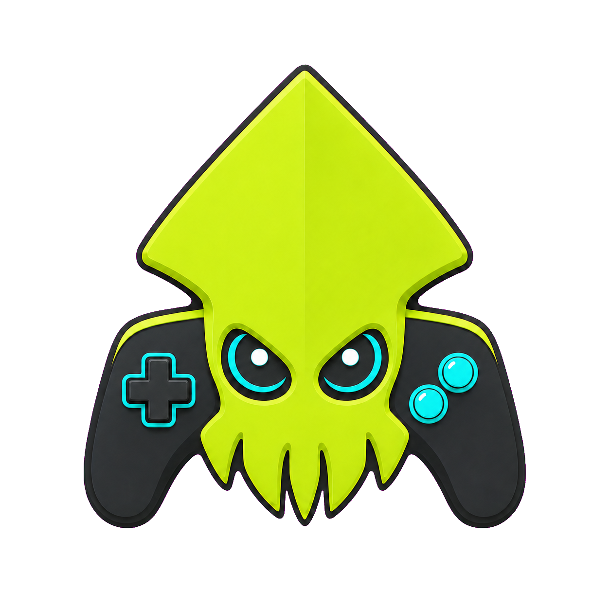
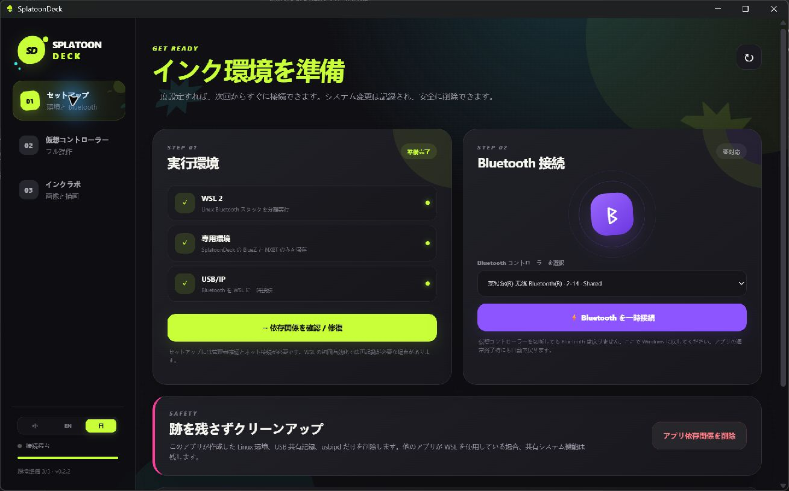
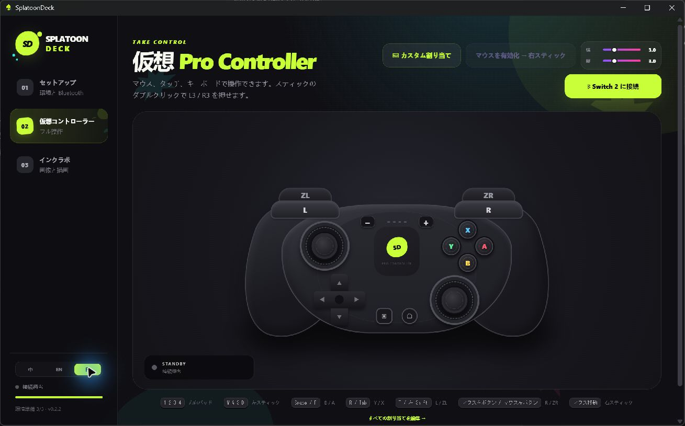
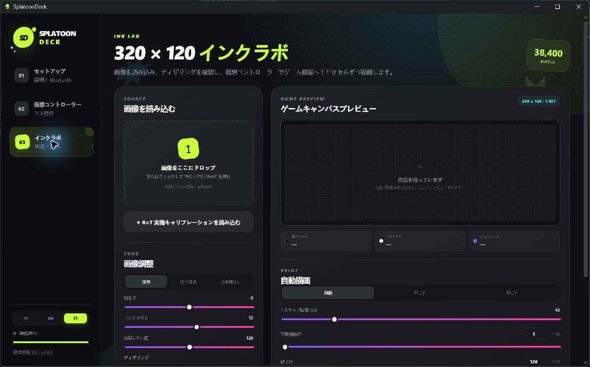

<p align="center">
  
</p>

<h1 align="center">SplatoonDeck</h1>

<p align="center">
  <a href="./README.md">简体中文</a> · <a href="./README_EN.md">English</a> · 日本語
</p>

<p align="center">
  <strong>キーボードとマウスで Switch 2 を操作し、好きな画像を Splatoon 3 に自動描画。</strong>
</p>

<p align="center">
  <a href="https://github.com/Polaris-SJTU/SplatoonDeck/releases/latest"></a>
  <a href="https://github.com/Polaris-SJTU/SplatoonDeck/releases"></a>
  <a href="./LICENSE"></a>
  
  
</p>

SplatoonDeck は、Splatoon 3 プレイヤー向けの Windows アプリです。PC を仮想 Pro Controller として動作させ、キーボードとマウスで Switch 2 を操作できます。写真、アイコン、文字、線画をゲーム内の投稿キャンバス向けに変換し、自動で描くこともできます。

ESP32、Raspberry Pi、専用のコントローラー変換基板は必要ありません。SplatoonDeck は独立した環境で Bluetooth 接続を管理し、使い終わったらアプリから Bluetooth を Windows に戻せます。

## ダウンロードと使い方

### 動作要件

- Windows 11 x64。
- Switch 2 と Splatoon 3。
- SplatoonDeck が検出できる、内蔵または既存の USB Bluetooth コントローラー。
- 初回セットアップ時のインターネット接続と管理者権限。

現在のバージョン：[`SplatoonDeck-0.2.2-portable.exe`](https://github.com/Polaris-SJTU/SplatoonDeck/releases/download/v0.2.2/SplatoonDeck-0.2.2-portable.exe)

SplatoonDeck は単一ファイルのポータブルアプリなので、通常のインストールは不要です。今後のバージョンは [GitHub Releases](https://github.com/Polaris-SJTU/SplatoonDeck/releases/latest) からダウンロードできます。

### 初めて Switch 2 に接続する

1. SplatoonDeck を起動し、**セットアップ**を開きます。左下の言語セレクターで簡体字中国語、English、日本語をいつでも切り替えられ、選択内容は自動で保存されます。
2. **依存関係を確認 / 修復**を選び、案内に従って WSL 2、専用環境、Bluetooth コンポーネントを準備します。再起動を求められた場合は、Windows を再起動してからアプリをもう一度開きます。
3. 互換性診断を実行し、WSL、USB/IP、BlueZ、NXBT、Bluetooth コントローラーがすべて準備完了になっていることを確認します。
4. 検出された Bluetooth コントローラーを選び、**Bluetooth を一時接続**を押します。
5. Switch 2 で **コントローラー → 持ちかた/順番を変える**を開きます。
6. SplatoonDeck の **仮想コントローラー**を開き、**Switch 2 に接続**を押します。
7. 接続後、画面上のボタンまたは標準のキーボード・マウス割り当てでゲームが反応することを確認します。

接続後は SplatoonDeck からゲームを操作してください。別の物理コントローラーを有効にすると、仮想コントローラーが切断される場合があります。**接続解除**は仮想コントローラーだけを切断し、Bluetooth は再接続しやすいよう SplatoonDeck 側に残します。Windows の通常の Bluetooth に戻す場合は、セットアップ画面で **Bluetooth を Windows に戻す**を押してください。

### キーボードとマウスで操作する

- 初期設定では `W` `A` `S` `D` が左スティック、マウス移動が右スティックに対応します。
- **マウスを有効化 → 右スティック**を押すと、ポインターがコントローラー領域にロックされます。解除するには `Esc` を押します。
- 横方向と縦方向の感度を別々に調整できます。
- **カスタム割り当て**から、キー、マウスボタン、マウス移動の割り当てを変更できます。
- 画面上の全ボタン、方向パッド、左右スティックをクリックまたはドラッグして操作することもできます。

### Splatoon 3 に画像を自動描画する

1. Splatoon 3 で横長の投稿用キャンバスを開き、描画できる状態にしておきます。
2. SplatoonDeck の **インクラボ**を開き、PNG、JPG、WebP、BMP 画像を読み込みます。
3. 全体表示、切り抜き、引き伸ばしのレイアウトを選び、明るさ、コントラスト、白黒しきい値、反転、ディザリング方式を調整します。
4. 右側の `320 × 120` 白黒ピクセルプレビューを確認します。プレビューと自動描画は同じピクセルデータを使用します。
5. 通常はスキャン方向を「自動」のまま使用できます。最初は標準の `45 ms` ボタン間隔を推奨します。
6. **自動描画を開始**を押します。キャンバスの消去、開始位置への移動、最小ブラシへの切り替えを自動で行ってから描画を始めます。
7. 描画中はカーソル位置、描画済みピクセル、進捗、残り時間を確認できます。完了すると保存確認も自動で行います。

途中で停止しても、画像と設定は保持されます。表示された進捗に合わせて **再開開始行 / 列**を変更し、もう一度開始してください。再開時は描画済みキャンバスを消去しません。

## 画面プレビュー

### セットアップ

実行環境の確認、Bluetooth の引き渡し、Windows への返却をまとめて行います。



### 仮想コントローラー

Pro Controller をイメージした画面、またはカスタムのキーボード・マウス割り当てで Switch 2 を操作します。



### インクラボ

画像を読み込み、白黒ピクセル表現を調整し、`320 × 120` のゲーム用キャンバスを確認して自動描画を開始します。



## 主な機能

### 本物のゲームパッドのように操作

- Pro Controller の全ボタンとレイアウト。
- キーボード、マウスボタン、マウス移動、タッチ操作に対応。
- すべての割り当てを変更可能。
- マウスの横方向・縦方向感度を個別に調整可能。
- 接続後は物理コントローラーに持ち替えず、そのままゲームを操作可能。

### ゲーム内に画像を自動描画

- PNG、JPG、WebP、BMP に対応。
- Splatoon 3 の `320 × 120` 白黒ピクセルキャンバスへ自動変換。
- 全体表示、切り抜き、引き伸ばしの 3 種類の画像レイアウト。
- 明るさ、コントラスト、しきい値、白黒反転の調整。
- 写真、アイコン、文字、線画に合わせた 4 種類のピクセル変換方式。
- 描画経路と同じピクセルデータを使ったリアルタイムプレビュー。
- キャンバス消去、最小ブラシ選択、開始位置への移動を自動化。
- 画像変更時の描画範囲更新と、行・列スキャンに対応。
- 方向パッドによる 1 ピクセル移動と、完全なコントローラー状態の継続送信による長時間描画の安定化。
- プレビュー上のカーソル位置と描画済みピクセルをリアルタイム表示。
- 残り時間、手動停止、範囲指定、中断後の再開に対応。

### 初めてでも扱いやすい環境管理

- USB Bluetooth コントローラーを自動検出。
- 必要なコンポーネントのインストール、確認、修復、削除をアプリ内で実行。
- Bluetooth を SplatoonDeck に一時的に渡し、いつでも Windows に返却可能。
- 互換性診断を内蔵。
- アプリ画面は簡体字中国語、English、日本語に対応し、前回の選択を記憶します。
- 既存の Linux ディストリビューションを変更しない専用実行環境。

## 画像処理

SplatoonDeck は読み込んだ画像を 38,400 個の白黒ピクセルに変換します。描画前に結果をリアルタイムで調整できます。

- **Floyd–Steinberg**：写真やグラデーションに適した細かな階調表現。
- **Atkinson**：アイコンやイラストに適したすっきりした表現。
- **Bayer 4×4**：規則的な網点パターン。
- **しきい値**：文字や線画に適したくっきりした輪郭。

プレビューキャンバスは常に `320 × 120` です。自動モードは画像に合わせて行または列の経路を選び、方向を手動指定することもできます。

## 標準のキーボード・マウス割り当て

| 入力 | コントローラー操作 |
| --- | --- |
| `W` `A` `S` `D` | 左スティック |
| マウス移動 | 右スティック |
| `Space` | B |
| `Tab` | X |
| `R` | Y |
| `F` | A |
| `T` | L |
| マウス右ボタン | R |
| 左 `Shift` | ZL |
| マウス左ボタン | ZR |
| `Q` | L3 |
| `1` `2` `3` `4` | 方向パッド 上、下、左、右 |
| `-` `+` | マイナス、プラス |
| `H` | HOME |
| `C` | キャプチャー |

すべての割り当ては **仮想コントローラー → カスタム割り当て**で変更できます。

## よくある質問

### コントローラーを切断しても Bluetooth が Windows に戻らないのはなぜですか？

次回 Switch 2 に接続するとき、Bluetooth をもう一度引き渡す必要がないようにするためです。ヘッドホンやマウスなどの Windows Bluetooth 機器を使う場合は、セットアップ画面で **Bluetooth を Windows に戻す**を押してください。

### 自動描画中に仮想コントローラーを操作できますか？

できません。余分な入力でカーソルが動かないよう、描画中は画像設定とコントローラー操作をロックします。停止または完了すると自動で解除されます。

### 中断した描画を再開するには？

インクラボに戻り、停止位置に合わせて **再開開始行 / 列**を設定します。元の画像とその他の設定を変えずに再開してください。再開モードではキャンバスを消去しません。

### 描画をより安定させるには？

まず標準の `45 ms` 間隔と内蔵の `8 × 7` キャリブレーション画像を使用してください。自動描画中は Switch 2 のコントローラーを切り替えたり、別のコントローラーを操作したりしないでください。

### SplatoonDeck が作成した環境を削除するには？

セットアップ画面で Bluetooth を Windows に戻してから、**アプリ依存関係を削除**を押します。SplatoonDeck が作成した専用環境が削除されます。

## 仕組みと互換性

Windows アプリは画像処理、キーボード・マウス入力、描画進捗を担当します。専用の WSL 2 環境は BlueZ と仮想 Pro Controller を実行します。Bluetooth コントローラーを USB/IP で一時的に接続し、NXBT と Python ブリッジからボタン、スティック、描画経路を Switch 2 へ送信します。

自動描画前に、画像を厳密な `320 × 120` の 1 ビット白黒行列へ変換します。プレビュー、描画経路、進捗データはすべて同じ行列から生成されます。描画中は完全なコントローラー状態を継続送信し、内容のある行または列ごとにキャンバス端へ再調整して、累積誤差を抑えます。

現在の互換性基準：

- Windows 11 x64。
- Switch 2 と Splatoon 3。
- USB/IP で接続できる USB Bluetooth コントローラー。
- SplatoonDeck の専用環境で管理される WSL 2、BlueZ、NXBT。

PC ごとに Bluetooth チップセットとドライバーが異なります。初回は内蔵の互換性診断と `8 × 7` キャリブレーション画像を使用してください。

## 開発とビルド

Git、現在サポートされている Node.js LTS、npm が必要です。

```powershell
git clone https://github.com/Polaris-SJTU/SplatoonDeck.git
cd SplatoonDeck
npm.cmd install
npm.cmd run dev
```

```powershell
npm.cmd test       # テストを実行
npm.cmd run build  # UI をビルド
npm.cmd run dist   # ポータブル EXE を作成
```

主なディレクトリ：

```text
SplatoonDeck/
├─ src/        アプリ UI、入力割り当て、画像処理
├─ electron/   Windows 連携、Bluetooth、アプリのライフサイクル
├─ backend/    仮想コントローラーブリッジ
├─ scripts/    環境のセットアップ・削除スクリプト
├─ assets/     ブランドのソースファイル
└─ build/      アプリアイコン
```

## コントリビューション

提案、互換性レポート、不具合報告は [Issues](https://github.com/Polaris-SJTU/SplatoonDeck/issues) へお寄せください。Pull Request も歓迎します。

コードを提出する前に、次のコマンドを実行してください。

```powershell
npm.cmd test
npm.cmd run build
```

## 謝辞

- [Microsoft WSL](https://learn.microsoft.com/windows/wsl/)
- [usbipd-win](https://github.com/dorssel/usbipd-win)
- [NXBT](https://github.com/Brikwerk/nxbt)
- [img2splat](https://github.com/JonathanNye/img2splat)

## ライセンス

コードは [MIT License](./LICENSE) の下で公開されています。

SplatoonDeck は独自のインターフェースおよびブランド要素を使用しており、Nintendo または Splatoon の公式素材を含みません。本プロジェクトは Nintendo、Nintendo Switch、Switch 2、Splatoon、または各権利者との提携、スポンサー、承認関係にありません。関連する名称および商標は、それぞれの権利者に帰属します。
